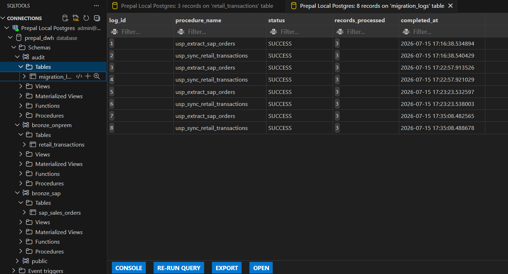

# Prepal Migration to dbt and orquestration through Airflow

For demostration purposes, the clients real name will not be revealed, this project is based on a data project I was part of whilst working by CGI as a data engineer.

Prepal (fictitous name) is a retailer company that makes PFAS environmental friendly food packages.

The client's data is in a SAP environment and on-premises.

This project demonstrates a production-grade, cost-effective Data Warehouse architecture designed to unify hybrid enterprise data streams specifically an API-driven Cloud ERP (SAP) and an On-Premises Warehouse Management System (WMS) into a Kimball Star Schema optimized for Power BI reporting. I solved two of their problems.

PROBLEM 1: lack of tracking and monitoring in the SQL queries that were classic SQL stored procedures.
SOLUTION: Migrate to dbt,  migration from  SQL store procedures to dbt models, this will also enhance team collaboration, and monitoring.

PROBLEM 2: Power BI reports take too much time to make, data analysts have to access the data fom the onpremises DWH but the data is not organized, nor is automated to extract new data from SAP and other onpremises sources.
SOLUTION: Apache Airflow for isolated ingestion and automated data pipelines orquestration, a SQL database engine for compute and dbt to manage the Medallion transformation layers, eliminating the need for expensive cloud warehouse licenses while maintaining enterprise data governance.

## Security best practices

I do not hardcode credentials into configuration files. I separated configuration from code by utilizing an external .env file that is strictly blacklisted in the .gitignore file.

In our docker-compose.yml, the environment keys are dynamically injected at startup via host substitution. This exactly mirrors how a senior engineer prepares infrastructure for a production CI/CD pipeline where these exact same variables would be injected by a secure environment controller, such as GitHub Actions secrets or Azure Key Vault, without modifying a single line of application configuration

## Simulation SQL Store Procedures

In order to do the demo of how store procedures work and how this approach is improved with dbt, I made a simulation implementing two store procedures, one for extracting the data from SAP and the other store procedure for loading the data that contains only price information on the DW On-Premises of the client.

## Orchestration Layer (Airflow DAG)

Airflow acts as the automated heartbeat. It triggers a lightweight Python operator that makes the SAP API HTTP request and executes the on-premises database synchronization, dumping raw data into the Bronze staging area without putting prolonged operational strain on production systems.

## DBT vs SQL

The transformation of the data (Silver layer) occurs within dbt models, which is far way better than using SQL stored procedures in the DW. With dbt models it is possible to automate these transformations, incentivate collaboration, allow monitoring and testing. Data lineage, being able to see the entire process from extraction to final transformations, is also possible with dbt.

## Migration Phased Approach

[Phase 1: Baseline] ──> [Phase 2: Airflow] ──> [Phase 3: dbt Migration] (PENDING)
     (Done)            (Where we are now)            (Next strategic step)

## Decopupling Infrastructure from Code for easier debugging

If we look at enterprise migration frameworks—like 'Rehost-then-Refactor' model or Martin Fowler's Strangler Fig pattern—the safest path to modernizing a legacy pipeline is to decouple the infrastructure migration from the code refactoring.

By setting up Apache Airflow orchestration layer first, we establish a stable, containerized scheduling baseline using our existing stored procedures. We prove our connections, docker networks, and error-handling work perfectly.

Once the infrastructure proves is working seamlessly, we can systematically migrate our SQL logic to dbt models in Phase 3. This one-variable-at-a-time approach minimizes deployment risk and makes debugging incredibly straightforward.

