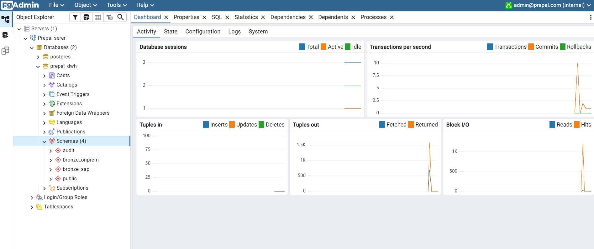

# Instructions to run the Postgres Stored Procedures and retrieve the data using Docker

Note that these commands will work in a Power Shell CLI:

1. To spin it up after cloning this repo:
        'docker-compose up -d'
2. To shut it down:
        'docker-compose down'
3. To pause it and save laptop memory
        'docker-compose stop'
4. To restart it:
        'docker-compose start'
5. Clean slate start and make sure everything is as left, old data is wiped and the new data is loaded:
        'docker compose down -v'
        'docker compose up -d'
6. Then, run the script with cat:
        'cat init_db.sql | docker exec -i prepal_postgres psql -U admin -d prepal_dwh'
7. Test the data and procedures:
        'cat test_run.sql | docker exec -i prepal_postgres psql -U admin -d prepal_dwh'

The Output should look like:
                CREATE SCHEMA
                CREATE SCHEMA
                CREATE SCHEMA
                CREATE TABLE
                CREATE TABLE
                CREATE TABLE
                CREATE PROCEDURE
                CREATE PROCEDURE
If status shows: SUCCESS, 2 rows and you see your stored procedures,schema and tables were successfully created.

## Exploring the tables via pgAdmin UI

Right-click Servers ➡️ Register ➡️ Server...

In the General tab:

Name: Any name will do.

In the Connection tab:

Host name/address: postgres (Because they are on the same Docker network, pgAdmin can resolve the container name directly)
The rest of information is found in the .env file.
